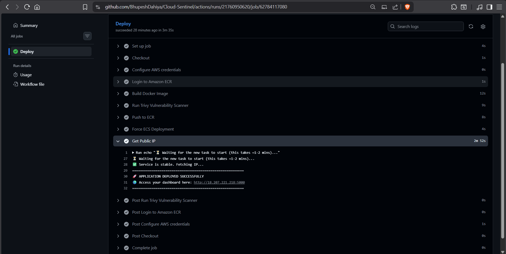
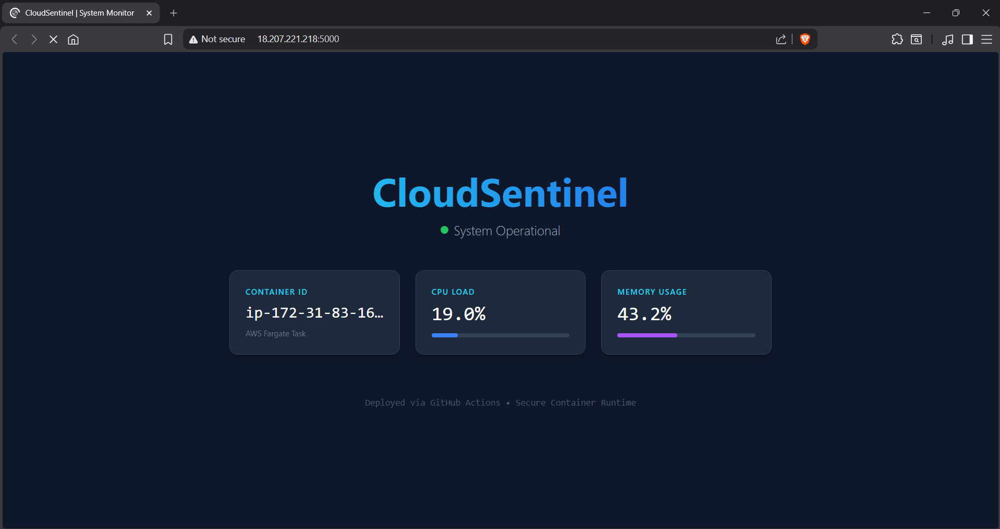

# 🛡️ CloudSentinel: Secure Container Observability Platform


**CloudSentinel** is a cloud-native monitoring application deployed on **AWS ECS Fargate**. It demonstrates a fully automated **DevSecOps** pipeline, featuring Infrastructure as Code (IaC), automated vulnerability scanning (Trivy), and real-time system observability.

---

## 📸 Screenshots
| **Live Dashboard** | **DevSecOps Pipeline** |
|:---:|:---:|
|  |  |
| *Real-time CPU/Memory metrics with Dark Mode UI* | *Trivy Security Scan with Risk Acceptance Policy* |

---

## 🏗️ Architecture
**Infrastructure:**
* **Compute:** AWS ECS (Fargate) for serverless container orchestration.
* **Registry:** AWS ECR for secure image storage with Lifecycle Policies.
* **Networking:** VPC, Security Groups, and IAM Roles tailored for Least Privilege.
* **IaC:** 100% of infrastructure provisioned via **Terraform**.

**CI/CD Pipeline (GitHub Actions):**
1.  **Build:** Docker image creation with optimized layers (Python 3.12-slim).
2.  **Secure:** **Trivy** vulnerability scanner checks image for CVEs (High/Critical).
    * *Includes `.trivyignore` implementation for documented risk acceptance of base-image CVEs.*
3.  **Deploy:** Pushes to ECR and forces a rolling update on ECS Fargate.
4.  **Verify:** Stability check (`aws ecs wait`) ensures the app is healthy before success.

---

## 🚀 Key Features
* **Real-Time Observability:** Custom Python/Flask backend using `psutil` to stream live CPU and Memory usage to a Tailwind CSS dashboard.
* **Rootless Security:** Container runs as a non-root user to mitigate privilege escalation attacks.
* **Self-Healing Infrastructure:** ECS Fargate automatically replaces unhealthy tasks.
* **Automated & Scalable:** Infrastructure defined entirely in Terraform for reproducibility.

---

## 🛠️ Usage

### View the Dashboard
Navigate to the Load Balancer/Public IP URL to see the system status.
* **Auto-Refresh:** Updates every 5 seconds.
* **Metrics:** Shows Container ID (Hostname), CPU Load, and Memory Usage.
* **Visuals:** Features a live "System Operational" pulse and dynamic progress bars.

---

## 💻 Getting Started

### Prerequisites
* AWS CLI & Terraform installed.
* Docker Desktop running.

### Local Installation
```bash
# Clone the repo
git clone [https://github.com/YOUR_USERNAME/cloud-sentinel.git](https://github.com/YOUR_USERNAME/cloud-sentinel.git)

# Build locally
cd app
docker build -t cloud-sentinel .

# Run container
docker run -p 5000:5000 cloud-sentinel
```
Optional step - the name for ECR repo is hardcoded here, so if you want some other name then edit ecr.tf and deploy.yml
